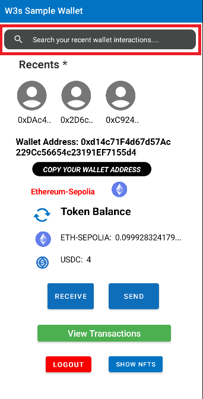
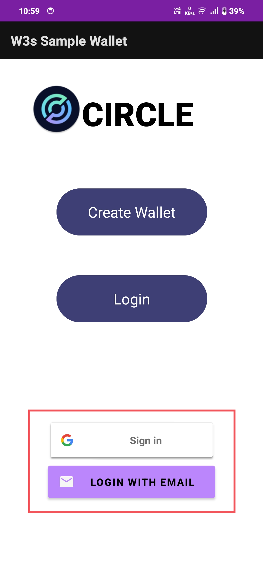
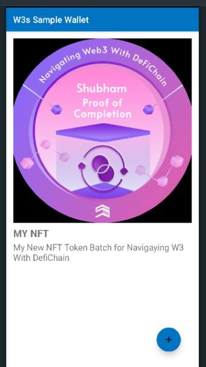

# W3 Wallet Bounty Submission

## Introduction
Welcome to W3 Wallet, an innovative cryptocurrency wallet application developed for the StackUp and Circle Developers bounty challenge. This comprehensive solution offers a range of core functionalities designed to streamline cryptocurrency management and transactions. With a focus on user experience and functionality, W3 Wallet aims to provide users with a secure and convenient platform for managing their digital assets.

## Core Functionalities
1. **Wallet Creation**: Simplifies the process of creating a new wallet, guiding users through the setup securely and efficiently.
2. **Wallet Transfers**: Facilitates seamless token transfers between wallets, allowing users to send and receive tokens with ease.
3. **Wallet Recovery**: Incorporates robust recovery functionality to ensure users can securely recover their wallet access if needed.

1. **Notifications**: Real-time notifications keep users informed about important wallet activities, such as successful transactions and token receipts.  
   

2. **Contacts**: A personalized contacts feature allows users to save and manage frequently used wallet addresses, simplifying the process of sending tokens to trusted contacts.  
    

4. **Social Login**: Integrates social logins for a seamless and familiar wallet creation and login experience.  
   

6. **NFTs**: Implements an NFT gallery feature that allows users to view, manage, and showcase their NFT collections directly within the wallet application.  
   
## Conclusion
W3 Wallet represents a significant advancement in cryptocurrency wallet applications, offering users a secure, convenient, and feature-rich platform for managing their digital assets. We believe that our submission meets and exceeds the requirements of the bounty challenge, and we look forward to your evaluation.

