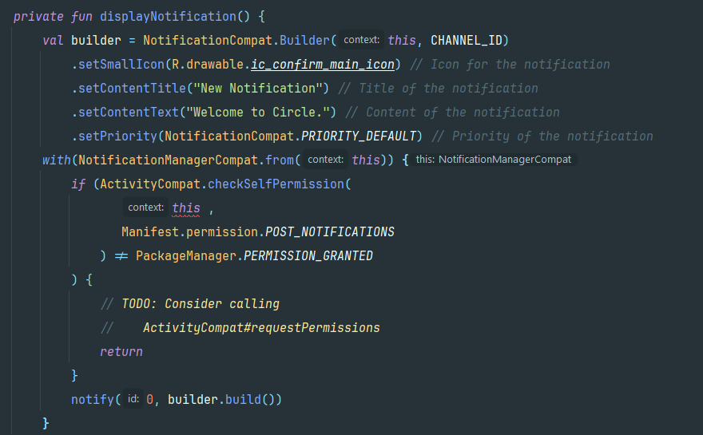
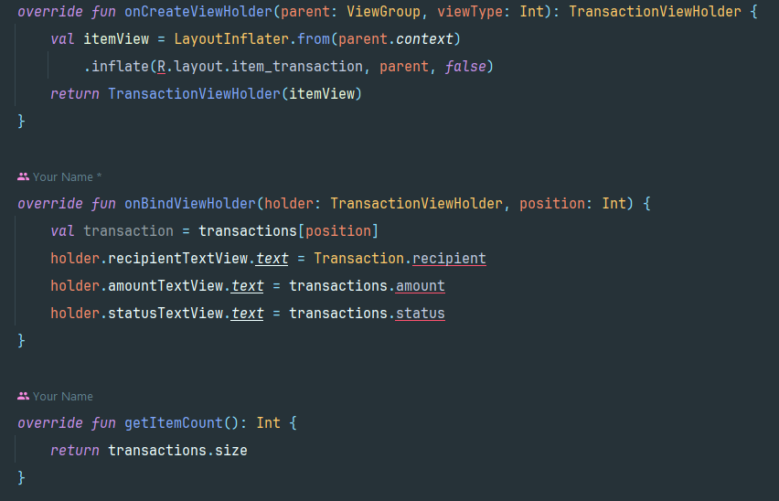
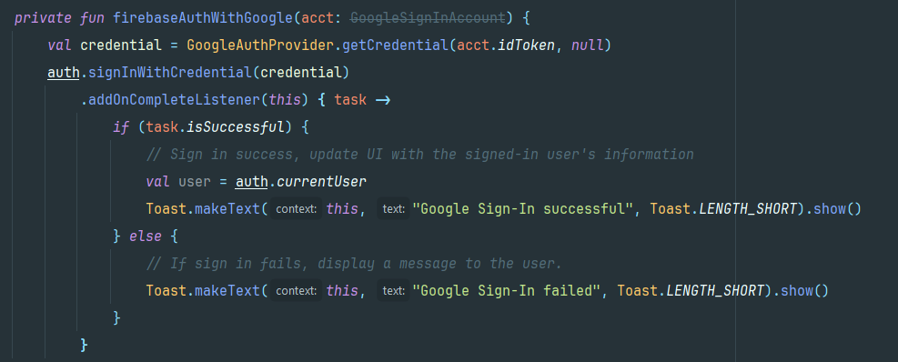
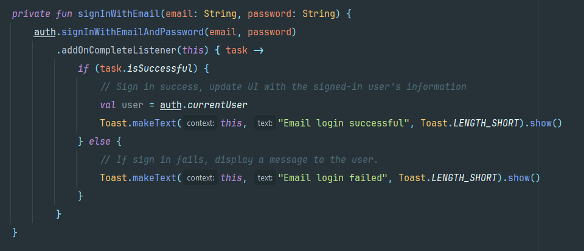
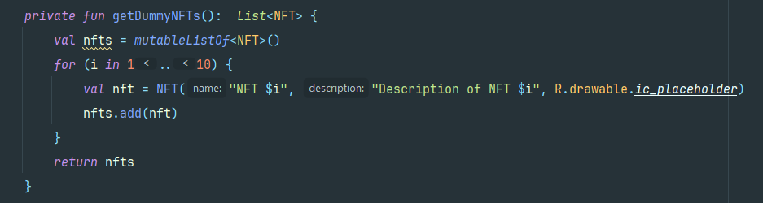

# W3 Wallet Bounty Submission

## Introduction
Welcome to W3 Wallet, an innovative cryptocurrency wallet application developed by shubham(me) for the StackUp and Circle Developers. This comprehensive solution offers a range of core functionalities designed to streamline cryptocurrency management and transactions. With a focus on user experience and functionality, W3 Wallet aims to provide users with a secure and convenient platform for managing their digital assets.

## Core Functionalities
1. **Wallet Creation**: Simplifies the process of creating a new wallet, guiding users through the setup securely and efficiently.
                        The wallet creation feature simplifies the process of setting up a new wallet within the application. Users 
                        can easily create a new wallet by following a few simple steps, ensuring a hassle-free onboarding experience.

3. **Wallet Transfers**: Facilitates seamless token transfers between wallets, allowing users to send and receive tokens with ease.
                         Facilitate smooth transfers of tokens between wallets. Users can easily transfer tokens (such as USDC) to 
                         other wallets within the application, enabling fast and efficient transactions.
   
5. **Wallet Recovery**: Incorporates robust recovery functionality to ensure users can securely recover their wallet access if 
                        needed. Incorporate PIN recovery functionality to allow users to recover their wallet access in case of loss 
                        or forgetfulness. This ensures that users can regain access to their wallets securely and easily.

## Additional Features
 Beside these core features i have integrated 4 additional features like Notifications , Contacts , Social Logins , NFTs .

1. **Notifications**: Real-time notifications keep users informed about important wallet activities, such as successful transactions and token receipts.  Implementing a notifications feature to alert users about key wallet activities, including successful transactions, received tokens, and more. Notifications enhance user engagement and keep users informed about important updates.
   
     

3. **Contacts**: A personalized contacts feature allows users to save and manage frequently used wallet addresses, simplifying the process of sending tokens to trusted contacts. Integrate a personalized contacts feature to streamline transactions by allowing users to save and manage frequently used wallet addresses. Users can label contacts for easy identification and facilitate quick transactions.
   
    

4. **Social Login**: Integrates social logins for a seamless and familiar wallet creation and login experience. Implement social logins for a seamless wallet creation and login experience. Users can create or log in to their wallet using their social media accounts, enhancing convenience and user adoption.
   
    
    

6. **NFTs**: Implements an NFT gallery feature that allows users to view, manage, and showcase their NFT collections directly within the wallet application. Incorporate an NFT gallery feature that allows users to view, manage, and showcase their NFT collections directly within the wallet application. This feature caters to users interested in digital collectibles and enhances the overall user experience.
   
   
   
## Conclusion
W3 Wallet represents a significant advancement in cryptocurrency wallet applications, offering users a secure, convenient, and feature-rich platform for managing their digital assets.

### The major components of our application is kept in the "main" folder.

For the actual java and kotlin files please refer **"main/java/com/circle/w3s/sample/wallet"**.
For layout and drawable files please refer **"main/res/layout"** and **"main/res/drawable"**
